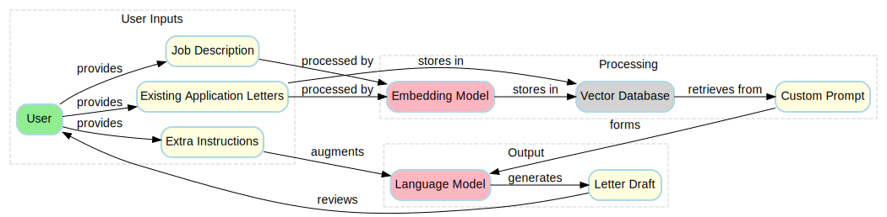

## Easy Letters

[](https://github.com/habedi/easy-letters/actions/workflows/tests.yml)
[](https://codecov.io/gh/habedi/easy-letters)
[](https://www.codefactor.io/repository/github/habedi/easy-letters)
[](https://github.com/habedi/easy-letters)
[](https://github.com/habedi/easy-letters/blob/main/LICENSE)
[](https://badge.fury.io/py/easy-letters)
[](https://pypi.org/project/easy-letters/)

Easy Letters is a Python library that provides the basic building blocks for creating a naive [retrieval augmented
generation (or RAG)](https://arxiv.org/abs/2312.10997) pipeline to generate application letter drafts.
The main idea is to speed up the process of writing application letters by not starting from scratch.
Instead, an applicant could generate a draft letter that can be used as a starting point and customized as needed
to make the final letter.

The diagram below shows the workflow of the naive RAG pipeline that the current version of Easy Letters can be used
to implement.



> [!NOTE]
> At the moment, Easy Letters only supports text generation and text embedding models from OpenAI.
> However, the library is designed to be extensible, so more features and models can be added in the future versions.

### Installation

```bash
pip install easy-letters
```

#### Installing from Source

You can also install Easy Letters from the source code in this repository.
The main benefit of this approach is that you might find it easier to run the sample notebooks and modify the code as
you wish this way.

After cloning this repository, you can navigate to the directory where you cloned the repository and install the
dependencies using [Poetry](https://python-poetry.org/):

```bash
git clone https://github.com/habedi/easy-letters.git && cd easy-letters

# Install the dependencies using Poetry
poetry install --with dev
```

### Getting Started

#### API Key Setup

Easy Letters gets the API key for supported services (like [OpenAI](https://platform.openai.com/)) from the environment
variables.
So you need to set the following environment variables to be able to use Easy Letters:

- `OPENAI_API_KEY`: The [OpenAI API key](https://platform.openai.com/docs/api-reference/authentication) (required)

#### Sample Notebooks

You can find Jupyter notebooks with example code in the [notebooks](notebooks/) directory.
The notebooks demonstrate how to use Easy Letters to generate application letter drafts.

### Supported Models

Easy Letters currently supports the following models:

| Model                            | Type            | Company |
|----------------------------------|-----------------|---------|
| GPT-3.5 Turbo                    | Text Generation | OpenAI  |
| GPT-4 Turbo                      | Text Generation | OpenAI  |
| GPT-4o                           | Text Generation | OpenAI  |
| GPT-4o Mini                      | Text Generation | OpenAI  |
| Text Embedding 3 (Small Variant) | Text Embedding  | OpenAI  |
| Text Embedding 3 (Large Variant) | Text Embedding  | OpenAI  |

### License

Easy Letters is available under the MIT license ([LICENSE](LICENSE)).
